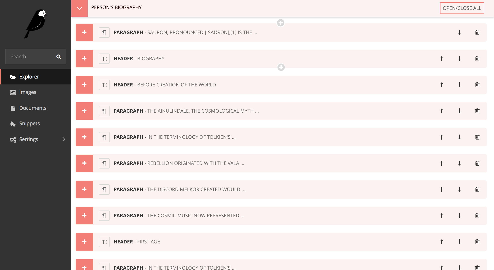
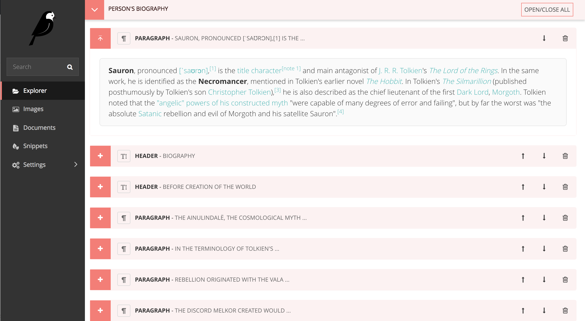

Wagtail Clear StreamField
============================
This is an amended version of Wagtail's StreamField interface that introduces a new class called `ClearField`

 - Much improved UI for nested StreamFields
 - Consistency of UI presentation between inline panels, streamfield panels, multipanels etc.
 - Always visible help text
 - Confirmation on delete of StreamField items 

Install
-------

To be written
