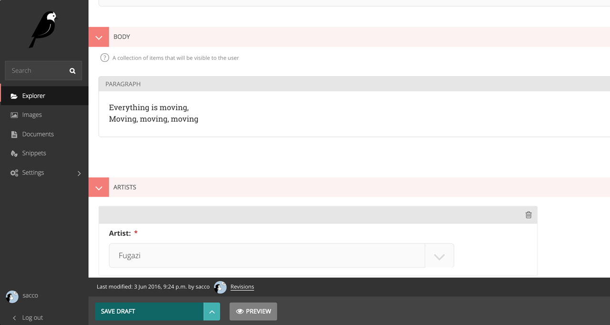

Wagtail Better Editor
=====================
This is an amended version of the Wagtail editor interface that makes it easier for users more easily visualises nested items and corrects a number of minor styling issues. Changes

 - Much improved UI for nested StreamFields
 - Consistency of UI presentation between inline panels, streamfield panels, multipanels etc.
 - Always visible help text
 - Consistent alignment of titles, fields and help text
 - Consistent alignment of success text, breadcrumb and title
 - Separation of meta data and actions in editor footer
 - Conforms AA to WCAG
 - Styling added to `delete` and `unpublish` actions in dropdown menu 

Install
-------

    pip install wagtailclearstream

Then add `wagtailclearstream` to your installed apps.
